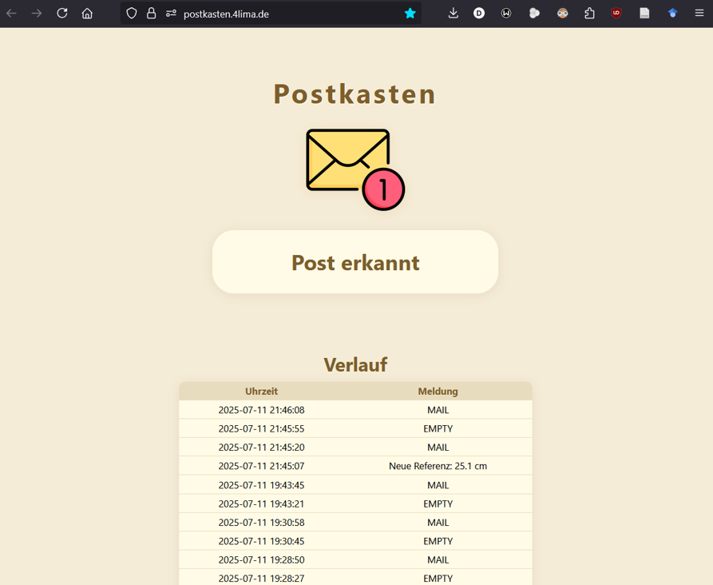
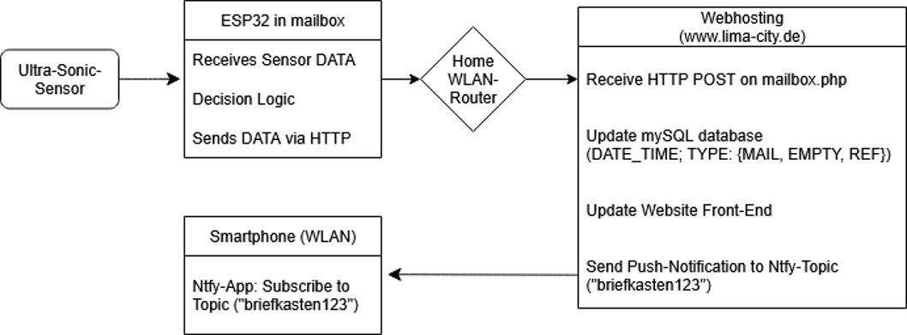

# 📬 IoT Mailbox – Automatic Mail Delivery Notification

---

### 💡 Project Idea

No more checking your mailbox just to find it empty.  
This project provides an **IoT-enabled mailbox** that detects incoming mail and updates your **online dashboard**, with **optional push notifications** when new mail arrives.

---

### 🧱 Repository Structure

| Path | Description |
|------|-------------|
| `postkasten_inhalt/` | Files for the hosted website at **https://postkasten.4lima.de** (mailbox status dashboard & backend logic). |
| `arduino_nano_esp32_code.ino` | Firmware running on the **Arduino Nano ESP32**, including sensor reading, sleep mode logic, and server communication. |
| `IoT-Pitch.pptx` | Project pitch presentation slides describing architecture, motivation, and implementation details. |

---

### 🛠 Hardware Components

| Component | Purpose |
|----------|---------|
| 🧠 **Arduino Nano ESP32** | Main controller + Wi-Fi communication |
| 📏 **Ultrasonic Distance Sensor** | Detects whether letters are present by measuring distance |
| 🔋 **Powerbank** | Enables cable-free, long-term power supply |

The ESP32 sleeps most of the time to save energy and wakes periodically to check the sensor.

---

### 🌐 Web Dashboard

🔗 **Live Dashboard:**  
https://postkasten.4lima.de

Functions:
- Shows current mailbox state (**Mail / No Mail**)
- Can log timestamps of mailbox events
- Lightweight UI for fast access from web or phone

---

### 📣 Optional Push Notifications via *ntfy*

Receive instant alerts when new mail arrives: https://ntfy.sh/

## 🔄 Workflow

### 👥 Authors

| Name | Role |
|------|------|
| **Raid Dokhan** | Development & System Integration |
| **Anas Homsi** | Presentation & Backend Configuration |

Project Timeline: **Summer Term 2025**

---

### 📄 License

This project is provided **for educational and non-commercial purposes**.  
Feel free to fork, improve, and adapt. 👍
